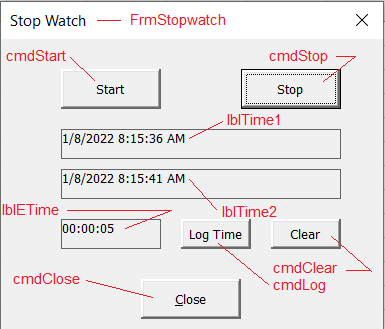

# VBAStopWatch
# This repository contains the files necessary to follow the tutorial on making an Excel VBA stopwatch.
The stopwatch is a form driven VBA application that simply records the elapsed time since the start button was pressed on the form. I use it to measure speed progress in building Excel workbooks. By practicing building workbooks using accelerator keys and programmed mouse buttons, the student can greatly reduce the amount of time spent contructing Excel workbooks. This exercise is not only about building a StopWatch for logging performance entries, but following instructions to the letter.
# Prerequisites:
1. The Developer tab must be visible in Excel.  
  Expose Excel Developer tab on Ribbon. Youtube: (https://www.youtube.com/watch?v=JLQ8OuW0FlY)
2. A trusted folder where VBA code can be run in Excel. 
  Add the folder where you want to build and run this exercise to Excel's Trusted Location list. Youtube: (https://www.youtube.com/watch?v=t5OcD1bk7Ek)
# Steps for Building the project
1. Download "SWVBA_GitFiles.zip" from "Code" button on Github.
2. Open “SWVBA_GitFiles.zip” and save the files to your local pc (place in Excel Trusted folder).
3. Rename "mod_Stopwatch.txt" to "mod_Stopwatch.bas"
4. Create SWEEWB1.xlsx workbook an "Save As" SWEEWB1.xlsm (macro enabled workbook type)
5. Click on the “Developer” tab to access the “Visual Basic” code window. Click on the “Visual Basic” icon. (the “Microsoft Visual Basic for Applications” window appears).
6. Create a userform and name it: frmStopwatch
  (note: it is important that you name the forms and controls as defined in these instructions, otherwise the code won't match with your controls and will never be executed.) 
The form should look like this:

7. Add 5 command buttons to the form (frmStopwatch). Show in red above. Name them as follows:
cmdStart,
cmdStop,
cmdLog,
cmdClear,
cmdClose,
8. Add 3 labels to the form (frmStopwatch). Name them as follows:
lblTime1
lblTime2
lblEtime
9. 

to be continued...

